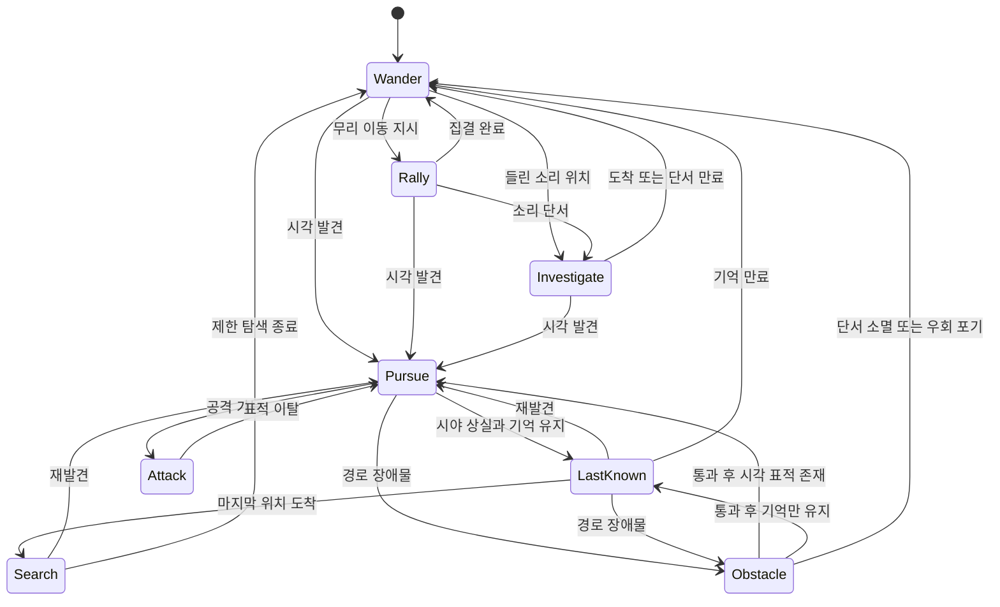

# 좀보이드식 시야·좀비 상태·생성 규칙을 하수도 파밍 게임으로 옮기는 조사

> 좀보이드 원본 코드는 옮기지 않았고 동작만 설명한다. 코드 블록은 새로 쓴 의사코드다. 링크 1곳을 직접 열어 대조했다. 조사 상태: COMPLETE. 이 문서는 조사 기록이며 확정 사항이 아니다. 사진·모델 파일은 저장소에 넣지 않고 링크만 둔다.

조사 기준일은 2026-10-07이다. 대상은 Godot 4.7.2로 만드는 모바일 가로 화면 3D 게임이다. 정차역에서는 사선 탑뷰로 수색하며, 새 좀비는 맨홀·하수도 출입구·지하 계단·배수구를 통해서만 지상으로 나온다. Godot 4.7.2의 공식 배포 기록을 확인했다. 아래 설계는 해당 엔진의 공개 API를 사용하는 안이며, 실제 프로젝트나 휴대전화에서 실행한 결과는 아니다. [S30](https://godotengine.org/download/archive/4.7.2-stable/)

먼저 확인한 기존 조사 파일은 `field_zombie_ai.md`, `pz_hordes_events_zombies.md`, `field_enemy_ai.md`이다. 그 문서에 있는 AI 개요·다른 게임 사례·모드 소개·기존 성능 전략은 여기서 다시 조사하거나 나열하지 않는다.

표시는 다음과 같다. **[1차]**는 개발사 블로그·공식 API 문서·직접 읽은 오픈소스이다. 위키와 포럼은 **[2차]**로 표시한다. **[모드: 이름]**은 해당 모드의 공개 코드에서 읽은 동작이다. **[재구성]**은 공개된 동작과 API 이름을 구현 가능한 상태로 묶은 설명이며, 본 게임의 내부 전이표가 아니다. **[제안]**은 이 게임에 넣을 독자 설계이다. 원문 문장을 인용하지 않고 요약했으며, 본 게임 구현·Lua 파일·디컴파일 결과를 옮겨 적지 않았다.

## 1. 한눈 요약

- 플레이어에게 보이는 범위와 좀비가 플레이어를 감지하는 범위를 따로 계산해야 한다.
- 원뿔만 그리면 벽 뒤까지 밝아진다. 방향·거리 검사에 문·벽·커튼의 가림 판정을 더해야 한다.
- Build 42 개발 자료는 어둠·날씨·낮은 장애물과 감지의 연결을 설명하지만, 현행 거리·각도·배율 공식은 확인 못 했다.
- 추격 목표를 현재 보이는 대상, 마지막 관측 위치, 소리 위치로 나누면 시야를 끊고 따돌리는 플레이가 생긴다.
- 넘어짐·기어가기·장애물 통과는 추격 여부와 별도로 관리해야 한다.
- 재생성, 기존 개체의 이주, 화면 밖 개체의 실체화를 서로 다른 사건으로 기록해야 한다.
- [제안] 지하 재고와 출구 통과량을 따로 제한하고, 소리는 이동과 출구 선택에 먼저 영향을 주게 한다.
- [제안] 휴대전화에서는 감지·경로 재계산을 분산하되, 가까운 공격·충돌 처리는 물리 프레임에 유지한다.

## 2. 시야 처리: 작동 방식 → 숫자 → Godot 구현

### 2.1. 화면의 시야와 좀비의 감각을 분리한다

**플레이어 화면의 가시성이다.** [1차·Build 42 개발 과정, 2023-07] 개발사는 이전의 타일 밝기 변화가 플레이어의 시야 방향과 가림을 표현했다고 설명했다. 캐시를 쓰는 새 렌더러에서는 화면에 단순 원뿔을 덮는 임시 방식이 장애물을 반영하지 못했고, 이를 개선한 정밀 LOS 표현을 공개했다. 문과 커튼의 열림·닫힘도 예시에 포함된다. 이 글은 개발 당시의 설명이지 Build 42.21 렌더링 내부 전체를 공개한 자료는 아니다. [S01](https://projectzomboid.com/blog/news/2023/07/knox-event-30-years-on/)

**좀비가 표적을 감지하는 계산이다.** [1차·Build 42 출시 전, 2024-11] 개발사는 빛의 밝기, 차량과 울타리에 의한 가림, 날씨를 좀비 감지에 더 연결하고 안개 낀 날 감각이 둔해지도록 했다고 설명했다. [1차·Build 42.0 출시, 2024-12] 출시 공지에도 날씨와 어둠에 따른 은신의 추가 조정이 필요하다고 적혀 있다. 두 자료로 방향과 출시 당시의 조정 대상을 확인할 수 있다. Build 42.21의 안개·비·밤별 실제 배율이나 최솟값은 확인 못 했다. 화면에 안개가 그려진다는 이유만으로 감지 반경도 같은 비율로 줄었다고 계산하면 안 된다. [S02](https://projectzomboid.com/blog/news/2024/11/whatz-next/), [S03](https://projectzomboid.com/blog/news/2024/12/build-42-unstable/)

**뒤쪽의 가까운 좀비가 보이는 현상이다.** [2차·Build 41 설명 기준] Keen Hearing 문서는 청각을 통한 지각 범위가 커지고 뒤에서 접근하는 좀비를 더 일찍 볼 수 있다고 설명한다. 따라서 화면에 나타난 좀비가 모두 정면 시야 원뿔로 발견된 것은 아니다. 이번 자료에서는 바닐라의 전방위 소리 화살표·벽 너머 정확한 위치 아이콘을 확인 못 했다. 청각 지각으로 개체가 나타나는 현상과 화면상의 소리 방향 UI를 구분해야 한다. [S05](https://pzwiki.net/wiki/Keen_Hearing)

### 2.2. 확인한 숫자와 숫자로 쓰면 안 되는 설명

| 항목 | 공개 자료에서 확인한 내용 | 판본과 제한 |
|---|---|---|
| 플레이어 시야 원뿔 각도 | 좋은 조건에서 거의 180°라는 포럼 설명이 있다. 어둠·피로·공황으로 좁아진다는 설명도 있다. | [2차·Build 41 시기, 2020-11] 커뮤니티 설명이다. 고정 기본값이나 Build 42.21 상수로 쓰지 않는다. [S04](https://theindiestone.com/forums/topic/31347-does-my-character-have-glaucoma/) |
| 플레이어 시야 거리·좀비 시야 각도/거리 | 정확한 기본 거리, 특성별 각도 변화량은 확인 못 했다. | Build 41·42 모두 이번 허용 자료로 공식을 확정하지 못 했다. |
| Keen Hearing | 지각 반경이 보통의 200%라고 설명한다. | [2차·Build 41.78.16 설명 기준, 일부 Build 42 자동 갱신 혼재] 좀비의 청각이 아니라 플레이어 특성이다. 기준 반경의 타일 수는 확인 못 했다. [S05](https://pzwiki.net/wiki/Keen_Hearing) |
| Eagle Eyed | 원뿔이 넓어지고 시야 갱신이 빨라진다고 설명한다. | [2차·Build 41 설명 기준] 각도·페이드 시간 수치는 확인 못 했다. 좀비 Lore의 Eagle 설정과 별개이다. [S07](https://pzwiki.net/wiki/Eagle_Eyed) |
| Short Sighted | 본문에서 확인되는 수치는 채집 반경 보정 −2이다. 설명문은 짧은 시야를 언급한다. | [2차·Build 41 설명 기준] −2를 좀비 감지 거리 감소로 바꾸면 안 된다. 본문과 설명문의 범위가 다르며 Build 42.21의 안경 효과도 미확인이다. [S06](https://pzwiki.net/wiki/Short_Sighted) |
| 밤·안개·비 | 감지와 연결한다는 개발 설명은 있다. | [1차·Build 42 출시 전/42.0] 감지 거리 감소율, 빗소리의 청각 마스킹 공식, 현행 하한은 확인 못 했다. [S02](https://projectzomboid.com/blog/news/2024/11/whatz-next/), [S03](https://projectzomboid.com/blog/news/2024/12/build-42-unstable/) |
| 공개 Unity 예제의 감지 주기 | 대상 탐색을 0.2초 간격으로 하고, 시야 메시는 화면 갱신 때 만든다. | [1차·오픈소스 예제, commit `43bc951`] 예제 값이며 PZ나 휴대전화의 권장값이 아니다. [S15](https://github.com/SebLague/Field-of-View/blob/43bc951cf78fc7eda9e62d280a153fe905e02e2a/Episode%2003/FieldOfView.cs) |

청각 저하·청각 상실 특성의 현행 수치, Cat's Eyes의 현행 밤 시야 배율은 확인 못 했다. 이를 임의의 배율로 채우지 않는다.

### 2.3. 오픈소스에서 실제로 읽은 구현

**Field-of-View이다.** [1차·MIT, Unity 예제] `Episode 03/FieldOfView.cs`는 거리 안의 대상 후보를 모으고, 앞 방향과 대상 방향의 각도를 검사한 다음 장애물 레이를 쏜다. 시야 표시에는 원뿔 안의 여러 레이를 사용한다. 이웃 레이의 충돌 여부나 도달 거리가 달라지는 곳은 추가 탐색해 벽 모서리를 보정하고, 결과 점을 삼각형 부채꼴 메시로 만든다. 대상 발견 검사와 보이는 메시 만들기가 분리돼 있다. Godot로 옮길 때 참고할 핵심은 이 분리와 경계 보정이다. [S15](https://github.com/SebLague/Field-of-View/blob/43bc951cf78fc7eda9e62d280a153fe905e02e2a/Episode%2003/FieldOfView.cs), [S16](https://github.com/SebLague/Field-of-View/blob/43bc951cf78fc7eda9e62d280a153fe905e02e2a/LICENSE.md)

**godot-4-fog-of-war이다.** [1차·MIT, Godot 4 예제] `game.gd`는 검은 이미지에 밝은 텍스처를 누적 혼합하고 `ImageTexture`를 갱신한다. 이동 여부와 갱신 간격을 확인한다. 그러나 방향 원뿔·장애물 레이·현재 보이는 적의 숨김은 없다. 기본 간격은 0.01초이며 휴대전화 최적화 값으로 그대로 쓰지 않는다. 이 코드를 그대로 쓰면 한 번 밝힌 곳이 계속 남으므로, 적을 숨기는 현재 가시성 마스크로 사용할 수 없다. [S17](https://github.com/TABmk/godot-4-fog-of-war/blob/e98acd3ccab1d8913d4e5ff0ee5a052c096a4007/game.gd), [S18](https://github.com/TABmk/godot-4-fog-of-war/blob/e98acd3ccab1d8913d4e5ff0ee5a052c096a4007/LICENSE)

### 2.4. [제안] Godot 4.7.2 노드와 데이터

```text
FieldRoot : Node3D
├─ Player : CharacterBody3D
│  └─ EyeAnchor : Marker3D
├─ StationGeometry : Node3D
│  └─ 벽·문·울타리별 StaticBody3D/충돌 형상
├─ VisibilityController : Node3D
│  ├─ ViewMesh : MeshInstance3D + ArrayMesh
│  └─ 현재 가시성 마스크 / 탐색 이력 마스크
├─ SoundEventBus : Node
└─ SoundCueLayer : CanvasLayer
```

카메라의 `Camera3D.fov`는 화면 투영 값이다. 캐릭터의 감각 원뿔 각도로 사용하지 않는다. 사선 탑뷰의 평면 방향은 XZ에서 계산하고, 실제 가림 레이는 눈 높이에서 대상의 가슴·머리 쪽으로 쏜다. 바닥 평면만 검사하면 낮은 울타리 뒤에서 몸이 노출되는 상황을 구분하기 어렵다.

벽은 항상 가리고, 문·커튼은 상태에 따라 가림 레이어를 바꾼다. 낮은 가구·차량·울타리는 눈 높이와 자세에 따라 판정한다. 정적인 역 구조는 가림용 격자나 선분으로 캐시하고, 열리거나 부서진 물체만 해당 캐시를 갱신한다. 게임 화면의 일반 안개 효과만으로 적을 숨기지 않는다.

마스크는 둘로 나눈다. `current_visible`은 매 갱신 때 새로 만들고 적 표시를 결정한다. `explored`는 이전에 본 지형을 남긴다. 탐색 이력이 있어도 현재 안 보이는 좀비·체력바·그림자는 표시하지 않는다. 숨긴 좀비의 AI와 충돌은 필요한 범위에서 계속 동작한다.

[제안] 시야 메시의 중심과 경계점을 `ArrayMesh`의 삼각형으로 만들고, 바닥용 셰이더는 월드 XZ 좌표를 마스크 UV로 변환해 현재 가시성과 탐색 이력을 읽는다. 처음 구현은 CPU의 작은 `Image`·`ImageTexture`로 시작할 수 있다. GPU에 마스크를 그리려면 별도 `SubViewport`와 위에서 내려다보는 `Camera3D`에 시야 메시만 전용 렌더 레이어로 보여준다. 화면 표시용 카메라와 분리하며, 현재 가시성에 사용한 가림 결과는 적 표시 판정에도 공유한다. 여러 프레임으로 레이를 분산할 때는 한 묶음이 완성된 뒤 앞/뒤 마스크를 교환해 반쯤 계산된 화면이 나타나지 않게 한다.

Godot의 직접 물리 조회는 `_physics_process()`에서 수행한다. `PhysicsRayQueryParameters3D`에 가림 레이어와 자기 몸의 제외 목록을 지정하고 `direct_space_state.intersect_ray()`로 검사한다. 이는 공식 Godot 4.7 문서에 따른 API 사용이며, 아래 수치와 판정 정책은 제안이다. [S23](https://docs.godotengine.org/en/4.7/tutorials/physics/ray-casting.html)

```text
[제안] can_observe(observer, target, profile):
    delta = target.position - observer.position
    flat_delta = XZ(delta)
    if length_squared(flat_delta) > profile.range_squared:
        return false
    if length_squared(flat_delta) > epsilon:
        if dot(observer.forward_xz, normalize(flat_delta)) < cos(profile.angle / 2):
            return false
    # 실제 레이는 눈높이에서 수행한다. 후보만 적은 표본점으로 확인한다.
    for sample in target.visible_body_samples:
        if obstacle_ray_clear(observer.eye, sample, observer.body_rid):
            return true
    return false

[제안] refresh_player_visibility():
    current_visible.clear()
    rays = cast_cone_boundary_rays(player.eye, player.heading, visibility_profile)
    refine_only_edges_where_hit_or_distance_changes(rays)
    rasterize_visibility_polygon(rays, current_visible)
    explored = max(explored, current_visible)
    for zombie in nearby_candidates:
        direct_seen = can_observe(player, zombie, visibility_profile)
        audible_hint = perception_from_recent_sound(zombie)
        zombie.visuals.visible = direct_seen or allowed_close_perception(audible_hint)
        hide_unseen_healthbar_and_shadow(zombie, direct_seen)
```

위 의사코드는 원작 코드나 예제 소스의 전사가 아니다. `allowed_close_perception`은 뒤쪽 가까운 접근을 알려주는 별도 정책이다. 벽을 사이에 둔 소리는 정확한 모델을 노출하는 근거로 쓰지 않고 방향 힌트로 표시한다.

| 시험 항목 | [제안] 초기값 | 조정할 기준 |
|---|---|---|
| 플레이어 원뿔 | 160°, 맑은 낮 18m | 휴대전화에서 방향을 돌려 수색하는 동작이 읽히는지 확인한다. |
| 밤·안개·강우 | 낮 기준 거리의 0.55 / 0.60 / 0.85배 | 각각의 독립 시나리오 값이다. 동시 발생 시 단순 연속 곱셈 대신 별도 프로필을 사용한다. PZ 값이 아니다. |
| 가까운 뒤쪽 지각 | 가림을 반영한 2m 범위 | 듣는 소리를 정확한 벽 너머 개체 표시로 바꾸지 않는다. |
| 화면 방향 표시 | 8방향 부채꼴, 0.8초 유지 | 소리 위치 자체 대신 방향·대략의 거리·종류를 보여준다. |
| 시야 메시 | 기본 48개 레이, 경계 구간만 추가 분할 | 레이 수보다 문틀·모서리의 누락을 먼저 확인한다. |

## 3. 좀비 AI: 상태와 전이

### 3.1. 공개된 상태 이름과 실제 전이표의 경계

[1차·공식 모딩 API, 대상 게임 Build 미표기] 공개 클래스 목록에서 `ZombieIdleState`, `WalkTowardState`, `PathFindState`, `LungeState`, `AttackState`, `ThumpState`, `ClimbOverFenceState`, `ClimbThroughWindowState`, `ZombieFallDownState`, `ZombieOnGroundState`, `ZombieGetUpState`, `FakeDeadZombieState` 등을 확인했다. `IsoZombie` 문서에는 마지막으로 본 표적 좌표, 본 뒤 경과 시간, 표적을 본 시간, 샌드박스 기억 기간 조회 항목이 있다. **이름과 데이터 항목의 존재는 확인했지만, 호출 순서·타이머 단위·기간 값·전이 조건의 전체 구현은 공개 문서만으로 확인 못 했다.** [S10](https://projectzomboid.com/modding/zombie/ai/states/package-summary.html), [S11](https://projectzomboid.com/modding/zombie/characters/IsoZombie.html)

[2차·Build 41 설명 기준] 좀비는 표적이 보이면 이를 우선하고, 보이지 않을 때 소리로 방향을 바꾼다고 설명한다. 뒤쪽 소리에는 먼저 뒤를 살피고 돌아서는 동작이 있으며, 앉아 있는 개체는 공격 전에 일어나야 한다. 기억 설정의 실제 초 단위 값이나 사라진 표적을 찾는 구체적인 탐색 반경은 이 자료로 확정하지 않는다. [S31](https://pzwiki.net/wiki/Zombie)

### 3.2. 상태 표

아래 표의 상태 묶음과 들어가고 나오는 조건은 **[재구성]**이다. 대응하는 공개 클래스와 관측 설명을 사용해 Godot에서 구현하기 좋은 형태로 정리했다. 수치가 [제안]인 행은 원작 수치가 아니다.

| 상태 | 들어가는 조건 | 하는 일 | 나가는 조건 | 숫자와 출처 |
|---|---|---|---|---|
| 대기·배회 | 유효한 표적·단서가 없고 행동 가능하다. | 짧은 이동과 멈춤을 섞는다. 주변 자극을 받는다. | 시각 단서, 들린 소리, 무리 이동 지시가 생긴다. | `ZombieIdleState` 대응. 배회 간격은 확인 못 함. [S10](https://projectzomboid.com/modding/zombie/ai/states/package-summary.html) |
| 알아챔·방향 전환 | 정면 밖의 소리나 새 시각 단서를 받는다. | 몸을 돌려 단서 방향을 확인한다. | 대상이 보이면 추격한다. 소리만 있으면 해당 지점으로 간다. | 방향 전환 동작 설명은 [2차·B41]. 반응 시간은 확인 못 함. [S31](https://pzwiki.net/wiki/Zombie) |
| 소리 조사 | 시각 표적 없이 유효한 소리 위치를 받는다. | 소리 좌표를 목적지로 저장한다. 플레이어의 숨은 현재 좌표는 갱신하지 않는다. | 시각 발견, 더 우선하는 단서, 도착 또는 단서 만료이다. | 소리 사건 API와 위치 기반 상태의 [재구성]이다. 바닐라 소리 종류별 반경·TTL은 확인 못 함. [S12](https://projectzomboid.com/modding/zombie/WorldSoundManager.html) |
| 시각 추격 | 표적이 보이고 접근 가능하다. | 보이는 동안 관측 위치를 갱신한다. 직접 이동 또는 경로 이동을 한다. | 공격 거리, 시야 상실, 장애물, 넘어짐이다. | `WalkTowardState`·`PathFindState`·`LungeState` 대응이다. 공격 진입 거리는 확인 못 함. [S10](https://projectzomboid.com/modding/zombie/ai/states/package-summary.html) |
| 마지막 관측 위치로 이동 | 추격 중 표적이 가려지고 기억이 남아 있다. | 마지막으로 확보한 좌표까지 간다. | 재발견, 도착, 기억 만료, 통과할 수 없는 경로이다. | 마지막 관측 좌표 필드는 확인했다. 정확한 기억 시간은 확인 못 함. [S11](https://projectzomboid.com/modding/zombie/characters/IsoZombie.html) |
| 도착 후 탐색 | 마지막 위치에 도착했으나 표적이 없다. | [제안] 출입구·가까운 모서리를 제한적으로 살핀다. | 재발견 또는 탐색 시간 만료이다. | 독립적인 바닐라 Search 상태와 탐색 패턴은 확인 못 함. [제안] 4초, 후보 2곳만 조사한다. |
| 무리 합류·이동 | 특별한 표적 없이 무리 또는 가상 이동 목적지가 있다. | 집결점으로 가고 이웃과 간격을 둔다. | 개별 자극, 집결 완료, 목적지 변경이다. | [2차·B41] 집결 크기 20, 합류 거리 20, 무리 간격 15, 리더 반경 3이다. 길이 단위는 타일 기준으로 해석한다. [S08](https://pzwiki.net/w/index.php?oldid=435721), [S21](https://github.com/iPeer/PZSandboxOptionsEditor/blob/186450c0664f4e2b32206b91fd375c6f63976f82/settings.md) |
| 문·창·구조물 두드림 | 목표로 가는 길의 파괴 가능한 장애물을 만난다. | 장애물을 공격한다. 문 사용 능력이 있으면 별도 개방 경로를 선택한다. | 파괴·개방, 우회 경로, 단서 상실, 행동 중단이다. | `ThumpState` 대응이다. 파괴 피해·두드림 간격·문별 체력은 확인 못 함. [S10](https://projectzomboid.com/modding/zombie/ai/states/package-summary.html) |
| 울타리·창 통과 | 통과 가능한 낮은 울타리나 창과 연결된 경로를 만난다. | 통과 애니메이션 동안 이동 제어를 바꾼다. | 착지 후 추격·넘어짐·공격으로 간다. | `ClimbOverFenceState`·`ClimbThroughWindowState` 대응이다. 높은 벽도 모두 넘는다고 해석하지 않는다. Fence Lunge는 별도 설정이다. [S10](https://projectzomboid.com/modding/zombie/ai/states/package-summary.html), [S09](https://pzwiki.net/wiki/Custom_Sandbox) |
| 공격 | 표적이 닿는 범위이고 공격 가능하다. | 붙잡기·공격을 처리한다. | 표적 이탈, 공격 종료, 피격, 사망이다. | `AttackState` 대응이다. 물기 판정 주기·확률은 이번 조사 범위에서 확인 못 함. [S10](https://projectzomboid.com/modding/zombie/ai/states/package-summary.html) |
| 쓰러짐·지면·일어남 | 피격·넘기 등의 결과로 균형을 잃는다. | 이동과 공격을 해당 자세에 맞게 제한한다. | 회복하면 이전 행동을 재평가한다. 사망하면 종료한다. | `ZombieFallDownState`·`ZombieOnGroundState`·`ZombieGetUpState`가 별도로 존재한다. 복귀 시간은 확인 못 함. [S10](https://projectzomboid.com/modding/zombie/ai/states/package-summary.html) |
| 죽은 척·재활성화 | 해당 개체의 설정·상태가 조건을 만족한다. | 겉보기에는 쓰러진 채로 있다가 공격 가능한 상태로 돌아온다. | 재활성화 또는 확정 사망이다. | `FakeDeadZombieState`·`FakeDeadAttackState`가 존재한다. 확률·촉발 거리는 확인 못 함. [S10](https://projectzomboid.com/modding/zombie/ai/states/package-summary.html) |

기어가기는 별도 **이동 자세**로 두는 편이 좋다. 기어가는 좀비도 배회·소리 조사·추격을 할 수 있어야 한다. 넘어졌다는 이유만으로 영구적인 기어가기 개체로 바꾸지 않는다. 달리기·빠른 걸음·느린 걸음도 행동 상태의 수를 늘리는 대신 이동 프로필로 분리한다.

### 3.3. [재구성·제안] 상태도



위 그림은 주 행동의 흐름이다. 쓰러짐·기어가기·사망은 모든 해당 행동을 중단하거나 제약하는 자세·생명 상태로 처리한다. 원작의 완전한 상태 그래프라는 뜻은 아니다.

### 3.4. [제안] 기억과 단서 우선순위를 명시한 의사코드

```text
ZombieData:
    behaviour, posture, speed_profile, alive
    visible_target_id               # 감지 결과가 유효할 때만 사용한다.
    last_seen_position, last_seen_at
    sound_clue(position, expires_at, strength, source_id)
    investigation_destination, group_id
    path_version, navigation_goal, search_deadline, pursuit_clue_active

on_sound(event):
    if not room_and_distance_filter_accepts(event): return
    if can_currently_see_target(): return
    if event_is_more_relevant_than_current_clue(event):
        sound_clue = copy_event_location_and_expiry(event)
        investigation_destination = sound_clue.position
        behaviour = INVESTIGATE

sense_tick(now):
    observation = scan_filtered_candidates_with_los()
    if observation.found:
        visible_target_id = observation.id
        last_seen_position = observation.position
        last_seen_at = now
        pursuit_clue_active = true
        behaviour = PURSUE
    else:
        visible_target_id = NONE
        if behaviour == PURSUE:
            behaviour = LAST_KNOWN

decision_tick(now):
    if not alive: return DEAD
    if posture.blocks_movement: return update_recovery()
    if visible_target_id != NONE:
        goal = last_seen_position
        behaviour = ATTACK if attack_contact_is_valid() else PURSUE
    elif behaviour == SEARCH:
        if now >= search_deadline:
            pursuit_clue_active = false
            expire_current_sound_clue()
            behaviour = WANDER
        else:
            continue_limited_search()
        return
    elif sound_clue.is_valid(now):
        goal = investigation_destination
        if arrived(goal):
            expire_current_sound_clue()
            enter_search_once(now, max_duration=4_seconds, max_points=2)
            behaviour = SEARCH
        else:
            behaviour = INVESTIGATE
    elif pursuit_clue_active and now - last_seen_at < memory_seconds:
        goal = last_seen_position
        if arrived(goal):
            enter_search_once(now, max_duration=4_seconds, max_points=2)
            behaviour = SEARCH
        else:
            behaviour = LAST_KNOWN
    else:
        behaviour = RALLY if group_has_goal() else WANDER
        goal = group_goal() if group_has_goal() else choose_wander_point()
    if path_has_special_obstacle():
        perform_open_or_thump_or_traverse_or_detour()
    request_path_only_if_goal_or_passability_changed(goal)

physics_tick(delta):
    follow_existing_path_and_apply_movement(delta)
    resolve_contact_attack_and_posture(delta)
```

마지막으로 본 시각을 매 tick 갱신하면 안 된다. 표적이 안 보이는 동안 현재 좌표를 계속 읽으면 가림을 이용해도 따돌릴 수 없는 추격이 된다. 구현 원칙은 **시각 관측으로 얻은 좌표만 추격 기억에 기록하는 것**이다.

[제안] 기억은 짧음 3초·보통 8초·김 20초로 시험을 시작한다. 속도는 이동 자세별 독립 설정으로 두며 초기값은 느린 걸음 0.8m/s·빠른 걸음 1.2m/s·달리기 3.2m/s·기어가기 0.45m/s이다. 게임 시뮬레이션 시간을 쓰는 시험값이며 PZ 설정값이 아니다. 모바일에서는 회피할 여유와 열차로 돌아오는 동선을 기준으로 조정한다.

### 3.5. 무리가 서로 끌어들이는 방식과 냄새

집결 설정은 개별 좀비가 쉬는 동안 모이는 무리의 크기·합류 거리·리더 주변 반경을 다룬다. 가상 무리의 큰 이동과 같은 설정이 아니다. 좀비의 모든 울음이 이웃에게 플레이어 좌표를 전파한다는 규칙, 전체 무리의 완전한 기억 공유, 소리에서 소리로 무한히 이어지는 경보는 확인 못 했다. `Hearing` 설명에는 부서진 창이나 죽는 좀비 같은 소리에 반응하는 예가 있지만, 소리별 바닐라 이벤트 생성 조건은 확인 못 했다. [2차·B41 설명 기준; S09](https://pzwiki.net/wiki/Custom_Sandbox)

냄새로 감지·추적하는 바닐라 상태·거리·수명도 확인 못 했다. 필드 이름이나 설정 설명만 보고 피·시체·음식으로 추격한다고 확정하지 않는다. 기존 관련 설명은 `field_zombie_ai.md`에 있다.

[제안] 추격 중인 좀비가 이웃을 끌어야 한다면 행동 소리를 사건으로 발행한다. 사건에는 좌표·세기·발생 원인·만료 시각을 넣고, 받은 개체는 자기 감각과 가림으로 다시 판단한다. 전달받은 경보는 다시 경보로 발행하지 않으며, 같은 사건 ID를 한 번만 처리한다. 냄새를 추가한다면 약한 위치 단서로만 처리하고 시각처럼 플레이어 좌표를 지속 갱신하지 않는다.

### 3.6. 샌드박스 설정 표

아래 기본값은 **[2차·Build 41.78.16의 Apocalypse 설명 기준]**이다. 위키의 현행 페이지는 일부 Build 42 자동 갱신이 섞여 있어 Build 41 영구 링크와 함께 대조했다. Build 42.21의 현행 설정 목록·숫자 ID·기본값으로 그대로 저장하지 않는다. 범주 값은 메뉴 이름으로 적는다. [S08](https://pzwiki.net/w/index.php?oldid=435721), [S09](https://pzwiki.net/wiki/Custom_Sandbox)

| 설정 | 값과 뜻 | Build 41 기준 기본값·주의 |
|---|---|---|
| `ZombieLore.Speed` | Sprinters / Fast Shamblers / Shamblers / Random이다. | Fast Shamblers이다. 실제 m/s는 확인 못 함. |
| `Strength` | Superhuman / Normal / Weak / Random이다. | Normal이다. 문·플레이어에 대한 피해 상수는 확인 못 함. |
| `Toughness` | Tough / Normal / Fragile / Random이다. | Normal이다. 체력 상수는 확인 못 함. |
| `Cognition` | Navigate + use doors / Navigate / Basic navigation / Random이다. | Basic navigation이다. 문을 사용할 능력과 감각을 분리한다. |
| `Memory` | Long / Normal / Short / None / Random이다. | Normal이다. 초 단위 기간은 확인 못 함. |
| `Sight` | Eagle / Normal / Poor / Random이다. | Normal이다. 이름만으로 거리 배율을 정하지 않는다. |
| `Hearing` | Pinpoint / Normal / Poor / Random이다. | Normal이다. 소리 반응 범주의 설정이다. |
| `ThumpNoChasing` | 플레이어 단서 없이 배회 중 구조물을 공격하도록 허용하는 스위치이다. | 위키 기본 Off이다. 편집기 문서의 True와 충돌하므로 후자는 기본값 근거로 사용하지 않는다. |
| `ThumpOnConstruction` | 플레이어 건설물 파괴를 허용한다. | On이다. 문 개방 능력과는 별개이다. |
| `ActiveOnly` | Both / Night / Day이다. | Both이다. 비활성 시간에는 느려지고 추격이 줄어드는 설명이다. |
| `CrawlUnderVehicle` | Crawlers Only부터 Always까지의 빈도 범주이다. | Often이다. 기어가기 자세 자체를 만드는 설정이 아니다. |
| `ZombiesFenceLunge` | 낮은 울타리를 넘은 뒤 덮치는 행동의 허용이다. | On이다. 모든 높은 벽을 넘을 수 있다는 뜻이 아니다. |
| `ZombiesDragDown` | 복수 좀비가 플레이어를 끌어내리는 공격의 허용이다. | On이다. 발생 개체 수·확률은 확인 못 함. |
| `TriggerHouseAlarm` | 좀비의 침입으로 집 경보가 울릴 수 있게 한다. | Off이다. 경보는 다시 다른 개체의 단서가 될 수 있다. |
| Fake Dead Zombie Reanimation | 월드의 일부 개체, 쓰러뜨린 일부까지 포함, 사용 안 함이라는 범주이다. | 월드의 일부 개체가 기본이다. 옵션의 내부 숫자 ID를 추정하지 않는다. |
| `RallyGroupSize` | 쉬는 개체의 무리 크기이다. 0이면 무리 형성을 끈다. | 20마리이다. 건물·숲 구역의 예외를 가진 설명이다. |
| `RallyTravelDistance` | 집결하기 위해 이동하는 거리이다. | 20타일이다. 허용 범위 5~50이다. |
| `RallyGroupSeparation` | 무리 사이의 간격이다. | 15타일이다. 허용 범위 5~25이다. |
| `RallyGroupRadius` | 리더 주변에 머무는 거리이다. | 3타일이다. 허용 범위 1~10이다. |

집결 거리와 범위는 공개 편집기의 설정 문서에서도 확인했다. 해당 문서는 버전을 적지 않고 GPL-3.0으로 배포한다. 설정의 뜻을 참고했으며 코드를 가져오지 않았다. 바닐라 설정의 최대 무리 크기와 별도로 모든 좀비가 항상 정확히 그 수에 맞춰 묶인다고 해석하지 않는다. [S21](https://github.com/iPeer/PZSandboxOptionsEditor/blob/186450c0664f4e2b32206b91fd375c6f63976f82/settings.md), [S22](https://github.com/iPeer/PZSandboxOptionsEditor/blob/186450c0664f4e2b32206b91fd375c6f63976f82/LICENSE)

## 4. 생성과 재생성, 그리고 하수도 출입구로 옮긴 안

### 4.1. 처음 배치: 인구 지도는 후보 밀도이며 출입구가 아니다

기존의 지역 분포·큰 이동 개요는 `field_zombie_ai.md`, `pz_hordes_events_zombies.md`에 있다. 이번에 추가로 확인한 것은 **지도 제작자가 밀도 이미지를 공급하는 방법**이다.

[2차·공식 포럼의 2017 지도 도구 안내, 정확한 대응 Build는 확인 못 함] 안내서는 지형 이미지의 1픽셀을 게임의 1타일로 두고, 한 셀 크기의 지도를 300×300픽셀로 설명한다. 좀비 밀도 이미지는 가로·세로가 각각 그 1/10이다. 예를 들어 지형 600×600이면 밀도 이미지는 60×60이다. 검정은 생성 없음, 흰색은 가장 높은 밀도, 회색은 그 중간이라고 설명한다. 따라서 이 도구 규격에서는 밀도 이미지의 한 픽셀이 지형의 10×10타일 영역에 대응한다. 이 색을 정확한 개체 수로 변환하는 현행 함수는 확인 못 했다. [S13](https://theindiestone.com/forums/topic/21951-the-one-stop-tilezed-mapping-shop/)

이 수치를 Build 42.21의 새 분포 생성기 내부 규격으로 확정하지 않는다. 건물 내부의 지연 배치·특수 장면 배치도 인구 지도와 완전히 같은 규칙인지 확인 못 했다. 지도상 밀도는 지역의 목표 개체 수를 만들고, 실제 배치 가능 여부는 별도 조건으로 제한한다는 형태로 재구성할 수 있다.

### 4.2. 재생성·이주·실체화를 따로 기록한다

[1차·Build 32 도입 기록] 공식 빌드 기록은 재생성·이주와 시간에 따른 개체군 변화를 설명하며, 지도 가장자리에서 도달할 수 없는 폐쇄 구역에는 새 좀비가 생기지 않아야 한다고 적었다. 이것은 당시의 설계 설명이다. Build 42.21에서 폐쇄 구역을 검사하는 구체적인 경로·갱신 주기는 확인 못 했다. [S14](https://projectzomboid.com/blog/news/2017/02/buildstatus/)

| 규칙 | [2차·Build 41.78.16 설명 기준] 수치와 의미 | 구현할 때 구분할 점 |
|---|---|---|
| 전체 배수 | `PopulationMultiplier` 기본 1.0, 범위 0~4이다. | 지역 밀도의 목표량을 바꾼다. 즉시 전 지역에 실체를 만드는 명령으로 해석하지 않는다. |
| 시작 배수 | `PopulationStartMultiplier` 기본 1.0이다. | 시작 목표량의 조정이다. |
| 정점 배수·시점 | `PopulationPeakMultiplier` 1.5, `PopulationPeakDay` 28일이다. | 일반 Zombie 문서의 대략 30일 설명과 구분한다. 설정값은 28일이다. 정확한 중간 보간 함수는 확인 못 함. |
| 재생성 간격 | `RespawnHours` 72게임시간이다. 0이면 재생성을 끈다. | 72현실시간이나 처치 후 개체별 72시간 타이머가 아니다. |
| 최근 관측 제한 | `RespawnUnseenHours` 16게임시간이다. | 청크가 최근 관측됐으면 그곳의 재생성을 제한한다. 원뿔 마스크가 검정이라는 이유만으로 미관측 청크가 되지 않는다. |
| 한 번의 재생성량 | `RespawnMultiplier` 0.1이다. | 셀 목표량의 10%이다. 현재 생존 수의 10%라는 뜻이 아니다. |
| 이주 간격 | `RedistributeHours` 12게임시간이다. 0이면 자동 재분배를 끈다. | 같은 셀의 빈 부분으로 기존 개체를 옮기는 규칙이다. 생존 개체를 추가하는 작업과 구분한다. |

위 표는 위키와 공개 설정 문서를 대조한 값이다. [S08](https://pzwiki.net/w/index.php?oldid=435721), [S09](https://pzwiki.net/wiki/Custom_Sandbox), [S21](https://github.com/iPeer/PZSandboxOptionsEditor/blob/186450c0664f4e2b32206b91fd375c6f63976f82/settings.md)

**상한은 구분해야 한다.** 재생성 설명은 셀의 목표 개체 수를 기준으로 하지만, 외부에서 기존 무리가 들어와 목표를 넘는 경우까지 금지하는 전 세계 절대 상한이라고 볼 수 없다. 근처 플레이어로부터의 고정 금지 반경, 미관측 청크를 판정하는 정확한 엔진 기준, 초과 인구의 처리 순서는 확인 못 했다.

**재생성을 끄는 것과 세계가 멈추는 것은 다르다.** 이미 살아 있는 개체의 이동, 사건의 유인, 아직 실체화되지 않았던 기존 개체가 드러나는 현상을 구분해야 한다. 공개 API의 가상 좀비 관리 기능도 존재하지만, 바닐라의 실체화 거리·활성 개체 상한 숫자는 확인 못 했다. 이름만으로 특정 반경을 만들어 내지 않는다. [S32](https://projectzomboid.com/modding/zombie/VirtualZombieManager.html)

```text
[재구성] 지역 인구 관리:
    desired = population_target_from_density_and_elapsed_day(region)
    if respawn_enabled and respawn_cycle_due(region):
        deficit = max(0, desired - alive_count(region))
        allowance = min(deficit, desired * respawn_fraction)
        allocate_only_to_eligible_unseen_reachable_areas(allowance)
    if redistribution_cycle_due(region):
        move_existing_population_toward_empty_parts(region)
    if area_becomes_active:
        instantiate_existing_virtual_population_without_increasing_total()
```

이 식은 공개 설정의 뜻을 정리한 독자적인 재구성이다. 반올림·주기의 시작 시점·실패 뒤 재시도·인구 증가와 재생성 Off의 조합은 확인 못 했다. 정확한 바닐라 알고리즘으로 사용하지 않는다.

### 4.3. 끌어오기 사건과 모드 코드에서 추가로 확인한 숫자

바닐라 헬기·메타 사건의 개요는 `pz_hordes_events_zombies.md`에 있다. 사건이 무리를 이동시키는 효과와 새 개체를 공급하는 효과를 같은 기능으로 합치지 않는다.

**[모드: Expanded Helicopter Events·B42.15 폴더, commit `bb37908`]** 이번에 `EHE_heatMap.lua`의 사건 기록과 소멸 처리를 직접 읽었다. 위치를 가로·세로 300타일 단위로 묶고 사건의 세기·좌표·시각을 저장한다. 야외에서 발동한 조명탄은 기본 세기 100, 좀비 타격은 10, 야외 좀비 사망은 20을 입력한다. 실제 저장 세기는 구역 보정 뒤의 값이다. 각 사건은 기록 시각에 **보정된 세기 × 1,000밀리초**를 더한 만료 기준을 지나면 제거되며, 지역 누적치에서도 그 세기를 뺀다. 따라서 단순히 모든 값이 매초 일정 비율로 줄어드는 연속 감쇠와는 다르다. 이 값은 헬기 모드의 활동 기록이며 바닐라 좀비의 청각 반경·기억 시간이 아니다. [S19](https://github.com/TEHE-Studios/ExpandedHelicopterEvents/blob/bb37908277891541bddb7861f1cb82aec07beac6/Contents/mods/Expanded%20Helicopter%20Events/42.15/media/lua/server/EHE_heatMap.lua)

[제안] 여기서 가져올 수 있는 설계 원리는 사건마다 만료되는 기록을 두는 것이다. 실제 코드나 자원은 재사용하지 않는다. 현재 저장소의 별도 라이선스는 다른 게임으로의 코드 추출·재사용을 제한한다. 옛 AGPL 표기를 현행 허가로 쓰면 안 된다. [S20](https://github.com/TEHE-Studios/ExpandedHelicopterEvents/blob/bb37908277891541bddb7861f1cb82aec07beac6/LICENSE.md)

### 4.4. [제안] 하수도 출입구만 사용하는 인구 관리

**재고와 처리량을 나눈다.** 지하 재고는 아직 지상에 나오지 않은 개체 수이다. 출구 용량은 동시에 올라오는 개체 수와 일정 기간 통과량이다. 지상 수는 실제 개체와 가상 개체를 합한 수이다. 적 모델을 숨기거나 회수할 때 지상 개체가 재고로 복제되지 않게 한다.

| 항목 | [제안] 시험용 초기값·규칙 | 플레이어가 읽을 수 있는 결과 |
|---|---|---|
| 역 구역 지하 재고 | 소형 역 40마리, 대형 역 120마리부터 시험한다. | 소리를 계속 내도 한 번의 정차에서 무한히 늘어나지 않는다. |
| 맨홀 | 동시에 1마리, 한 묶음 2~4마리, 묶음 사이 120초이다. | 뚜껑 흔들림과 금속 소리 뒤에 차례로 나온다. |
| 하수도 출입구 | 동시에 2마리, 한 묶음 4~8마리, 묶음 사이 180초이다. | 큰 출구는 통과량이 많지만 그만큼 미리 읽기 쉽다. |
| 지하 계단 | 동시에 2마리, 한 묶음 3~6마리, 묶음 사이 150초이다. | 계단 안쪽 발소리와 그림자로 도착을 예고한다. |
| 배수구 | 기어가는 개체만 동시에 1마리, 한 묶음 1~2마리, 묶음 사이 180초이다. | 형태로 나올 수 있는 개체를 구분한다. |
| 지상 인구 제한 | 소형 구역 60마리, 대형 구역 180마리이다. 가상 지상 무리도 포함한다. | 화면 밖으로 옮겨도 인구 제한이 풀리지 않는다. |
| 즉시 위험 제한 | 플레이어와 출구 사이 거리가 6m 미만이면 일반 배출을 미룬다. | 발밑에 예고 없이 생기는 상황을 줄인다. |
| 가시 출구의 배출 | 보이는 출구도 배출할 수 있지만 최소 2초 전조와 올라오는 애니메이션을 거친다. | 눈앞에서 갑자기 완성된 개체가 생기지 않는다. |
| 봉쇄 | 철판·잠금·잔해의 구조 상태를 검사한다. 기본은 봉쇄 중 배출 중지이다. | 봉쇄 성공이 실제 안전 확보로 연결된다. |
| 봉쇄 뒤 대기 | 출구별 대기열 최대 8마리이다. 남은 재고는 연결된 다른 출구로 이주할 수 있다. | 잠깐 막았다 열 때 수백 마리가 한꺼번에 쏟아지지 않는다. |
| 봉쇄 파괴 | 파괴를 허용하는 출구만 안쪽 타격·내구도·전조로 처리한다. | 무조건 뚫리는 출구와 완전히 막을 수 있는 출구를 자원 비용으로 구분한다. |
| 소음 효과 | 사건 좌표로 지상 개체를 유인하고 연결된 지하 출구의 선택 가중치를 올린다. | 큰 소리에 여러 출입구가 활성화될 수 있으나 재고·인구·쿨다운 제한은 유지한다. |
| 재고 보충 | 정차 중에는 기본 Off이다. 다른 역 이동이나 긴 시간 경과 때 연결 지하 구역의 이주로 보충한다. | 잠시 수색을 마친 구역을 정리할 수 있다. 무한 생성을 원하면 별도 난이도 규칙으로 공개한다. |

표의 초는 일시정지를 제외한 게임 시뮬레이션 초이며, PZ의 게임시간 단위 재생성 설정을 환산한 값이 아니다. 거리·개체 수는 회색 상자 시험용이다.

출입구는 지하 연결 그래프의 포털이다. 각 노드는 `stock`, `sealed`, `health`, `next_release_at`, `queue`, `connected_regions`를 가진다. 플레이어가 다른 출구를 막거나 열면 선택 가능한 경로가 달라진다. 외부 헬기·열차 기적·붕괴 사건은 포털 가중치와 이동 목적지를 바꾸지만, 사건 하나가 인구를 무제한 생성하지 않는다.

처음 역에 들어갈 때 이미 지상에 있는 개체는 그 역의 과거 배출 기록으로 만든다. 새 게임의 사전 시뮬레이션에서도 출구를 통해 배출한 뒤 배회시킨다. 인구 지도에서 임의로 건물 안에 새 좀비를 찍는 작업은 이 설정에서는 사용하지 않는다. 기존 개체가 문을 통해 건물 안으로 이동하는 것은 가능하다.

```text
[제안] tick_outlets(now):
    replenish_underground_only_if_explicit_rule_allows()
    for outlet in due_outlets:
        if outlet.sealed or outlet.queue_is_full: continue
        if outlet.underground_stock == 0: continue
        occupied = surface_alive_including_virtual + emergence_reserved
        if occupied >= surface_cap: continue
        if player_is_inside_no_release_distance(outlet): continue
        if not reachable_exit_slot_exists(outlet): continue
        if outlet.is_visible and not warning_completed(outlet):
            start_warning_once(outlet)
            continue
        amount = min(outlet.batch_limit,
                     outlet.free_queue_slots,
                     outlet.underground_stock,
                     surface_cap - occupied)
        reserve_stock_and_slots_atomically(outlet, amount)
        enqueue_emergence(outlet, amount)
        outlet.next_release_at = now + outlet.cooldown

on_emergence_complete(reservation):
    underground_reserved -= reservation.count
    surface_alive += reservation.count
    activate_or_virtualize_existing_ids(reservation.ids)

on_emergence_cancelled(reservation):
    return_reserved_stock_and_release_slots(reservation)

on_killed(zombie):
    surface_alive -= 1
    dead_total += 1

on_visibility_or_distance_changed(zombie):
    change_representation_only()       # 생존 개체 수는 바꾸지 않는다.
```

예약된 배출도 상한 계산에 포함해야 여러 출입구가 같은 빈자리를 중복으로 예약하지 않는다. 단일 예약은 성공·취소 중 한 번만 처리한다. 보충이 꺼져 있는 동안 `지하 재고 + 배출 예약 + 지상 생존 + 확정 사망`의 총합이 유지되는지 검사한다.

## 5. 폰에서 싸게 돌리는 법

기존의 거리별 무리 전략은 `field_zombie_ai.md`에 있다. 여기서는 Godot 4.7의 실제 제약과 스케줄을 추가한다.

### 5.1. 경로 요청과 이동 갱신의 주기를 다르게 둔다

[1차·Godot 4.7 공식 문서] `NavigationAgent3D.target_position`을 플레이어의 현재 위치로 매 프레임 다시 지정하면 경로를 반복 요청할 수 있다. 목표가 충분히 움직였거나 통행이 바뀔 때 요청한다. 도달 가능 여부를 먼저 조회하고 다시 경로를 구하면 같은 일을 두 번 할 수 있다. 갱신 그룹을 나누고, 많은 폴리곤·간선 또는 도달 불가능한 목표가 만드는 큰 탐색 비용을 줄인다. [S24](https://docs.godotengine.org/en/4.7/tutorials/navigation/navigation_optimizing_performance.html)

그러나 기존 경로를 따라 움직이는 활성 에이전트의 `get_next_path_position()`은 경로가 끝날 때까지 물리 프레임마다 호출하는 공식 사용법을 따른다. 저주기 AI라는 이유로 근접 이동과 공격 판정을 초 단위로 건너뛰지 않는다. Godot 내비게이션은 부모 노드를 자동으로 움직여 주지 않으므로 이동 코드는 따로 필요하다. [S25](https://docs.godotengine.org/en/4.7/tutorials/navigation/navigation_using_navigationagents.html)

### 5.2. [제안] 시작 스케줄과 연산 상한

| 대상 | 사고·감지·경로 요청 | 이동·충돌·표시 |
|---|---|---|
| 가까운 위험 개체, 최대 24마리 | 판단 10Hz, 감지 5~10Hz, 목표가 1m 이상 움직이면 경로 갱신을 요청한다. | 공격·충돌·활성 경로 추종은 물리 프레임마다 한다. |
| 중간 거리 개체, 추가 최대 72마리 | 판단 2~5Hz이다. 같은 목표를 쓰는 무리는 경로·출입구 목적지를 공유한다. | 간단한 분리 이동을 사용한다. 근접 위험이면 즉시 상위 처리로 승격한다. |
| 먼 가상 무리 | 1~2초마다 지역·출구·단서 만료만 갱신한다. | 개별 노드·레이·충돌을 만들지 않는다. |
| 플레이어 시야 | 방향·위치·문 상태가 변할 때 갱신을 예약한다. 기본 10Hz, 회전 중 최대 15Hz부터 시험한다. | 적별 현재 가시성은 가까운 위험 개체부터 확인한다. |
| 한 물리 프레임의 새 작업 | 시야 레이 24개, 새 경로 요청 4개를 초기 작업 예산으로 둔다. | 플레이어 시야 메시 작업도 같은 레이 예산에 포함한다. 나머지는 다음 프레임으로 넘긴다. |

위 개체 수·Hz·거리는 전부 [제안]이다. 수십~수백 마리를 처리할 수 있다는 실측 보장이 아니다. 첫 구현의 전체 목표는 30fps, 프레임 시간 약 33.3ms이며 AI에는 우선 3ms를 배정해 측정한다. S22급 기기의 실제 발열·스로틀링·렌더링 비용을 보고 조정한다.

한 예로 100마리가 모두 5Hz 감지를 요청하면 후보 감지 작업은 초당 500회이다. 평면 거리·방향 검사를 통과한 후보만 레이로 확인해야 한다. 60Hz 물리 프레임에서 24개 레이 예산은 초당 최대 1,440개이다. 실제 물리 주기가 달라지면 한도도 달라진다. 이 산술은 처리량 설명이며 실행 시간 예측이 아니다.

음향 사건은 모든 좀비에게 보낸 뒤 검사하지 않는다. 공간 격자와 방·통로 연결표로 수신 후보를 줄인다. 반경 밖·같은 사건의 중복·이미 만료된 단서를 먼저 제외한다. 가림 레이는 거리 제곱과 방향 내적 검사를 통과한 대상에만 수행한다. 머리·가슴을 항상 모두 검사하지 않고 첫 유효점에서 끝낸다.

### 5.3. 가시성, 렌더링, 회피, 스레드의 경계

- **화면 진입과 캐릭터 시야를 구분한다.** `VisibleOnScreenNotifier3D`는 카메라에 잡히는 영역을 알리는 노드이다. 기본 판정은 벽 같은 가림을 반영하지 않으며, 노드의 `visible`이 꺼져 있으면 동작하지 않는다는 제약도 있다. 좀비의 정면 감각·벽 가림·복귀 조건의 유일한 근거로 쓰지 않는다. [S28](https://docs.godotengine.org/en/4.7/classes/class_visibleonscreennotifier3d.html)
- **MultiMesh는 AI를 처리하지 않는다.** 비슷한 먼 개체의 렌더링을 묶을 수 있지만 인스턴스별 화면 컬링이 안 되는 제약이 있다. 구역별로 나누고, 본격적인 개별 골격·충돌이 필요한 개체는 별도로 둔다. 해당 공식 문서에는 4.7 업데이트 미완료 경고가 있으므로 실제 좀비 애니메이션 적용은 시험해야 한다. [S26](https://docs.godotengine.org/en/4.7/tutorials/performance/using_multimesh.html)
- **회피와 경로를 구분한다.** NavigationAgent 회피는 등록된 이웃을 피하기 위한 별도 계산이다. 전 개체에 항상 켜지 않고 가까운 병목에 제한적으로 사용한다. 문·울타리의 의미 있는 통과 판정은 회피만으로 해결되지 않는다. [S25](https://docs.godotengine.org/en/4.7/tutorials/navigation/navigation_using_navigationagents.html)
- **스레드에는 순수 데이터를 넘긴다.** 활성 SceneTree 접근은 스레드 안전하지 않다. 가상 무리·격자 비용장·사건 만료처럼 배열만 다루는 작업을 분리하고, 노드 생성·재배치·텍스처 갱신은 주 스레드에 적용한다. 렌더링·물리 서버의 스레드 설정이 필요하다는 공식 제한을 건너뛰지 않는다. [S27](https://docs.godotengine.org/en/4.7/tutorials/performance/thread_safe_apis.html)
- **렌더러는 기기에서 비교한다.** Mobile과 Compatibility를 같은 장면에서 측정한다. 공식 문서는 Mobile을 단순한 모바일 장면에, Compatibility를 낮은 사양 장치에 적합한 선택으로 설명한다. S22라는 이름만으로 어느 쪽이 빠른지 확정하지 않는다. [S29](https://docs.godotengine.org/en/4.7/tutorials/rendering/renderers.html)

[제안] 시야 마스크는 현재/탐색 이력 각 256×256의 R8 배열부터 시작한다. 두 배열의 원시 픽셀 데이터 합계는 128KiB이다. GPU 복사본·정렬·리소스 부가 메모리는 별도이다. 마스크의 전체 이미지 업로드와 투명 오버레이의 화면 덮기 비용도 측정한다.

시험은 50·100·200마리, 문틀에 몰림, 안개와 밤, 여러 출구의 동시 배출, 길이 막힌 목표를 포함한다. 평균 FPS와 함께 상위 95% 프레임 시간, AI·경로·물리·애니메이션·그리기 시간을 따로 기록한다. 10분 이상 같은 조건에서 발열 이후도 확인한다. 이번 조사에서는 이 벤치마크를 실행하지 않았다.

## 6. 참고한 모드·오픈소스

코드 읽기와 코드 사용 허가는 별개이다. 아래 라이선스는 실제 LICENSE 파일을 확인한 내용이다. 저장소의 공개 여부만으로 사용 허가를 추정하지 않는다.

| 이름·확인한 판본 | 링크 | 라이선스 | 무엇을 볼 수 있나 | 우리 코드에 섞어 써도 되나 |
|---|---|---|---|---|
| Field-of-View, Unity 예제, commit `43bc951` | [코드](https://github.com/SebLague/Field-of-View/blob/43bc951cf78fc7eda9e62d280a153fe905e02e2a/Episode%2003/FieldOfView.cs), [라이선스](https://github.com/SebLague/Field-of-View/blob/43bc951cf78fc7eda9e62d280a153fe905e02e2a/LICENSE.md) | MIT이다. | 원뿔 후보 판정, 장애물 레이, 모서리 보정, 시야 메시이다. | 가능하다. 실제 이식 시 저작권 고지와 MIT 허가문을 포함해야 한다. Unity API는 Godot로 바꿔야 한다. |
| godot-4-fog-of-war, commit `e98acd3` | [코드](https://github.com/TABmk/godot-4-fog-of-war/blob/e98acd3ccab1d8913d4e5ff0ee5a052c096a4007/game.gd), [라이선스](https://github.com/TABmk/godot-4-fog-of-war/blob/e98acd3ccab1d8913d4e5ff0ee5a052c096a4007/LICENSE) | MIT이다. | 누적 탐색 이미지와 이동 조건 갱신이다. 벽 가림·현재 적 숨김은 없다. | 가능하다. 고지를 유지해야 한다. 2D 예제이므로 3D 좌표와 현재 가시성은 별도 구현해야 한다. |
| Expanded Helicopter Events, `42.15` 폴더, commit `bb37908` | [활동 기록 코드](https://github.com/TEHE-Studios/ExpandedHelicopterEvents/blob/bb37908277891541bddb7861f1cb82aec07beac6/Contents/mods/Expanded%20Helicopter%20Events/42.15/media/lua/server/EHE_heatMap.lua), [라이선스](https://github.com/TEHE-Studios/ExpandedHelicopterEvents/blob/bb37908277891541bddb7861f1cb82aec07beac6/LICENSE.md) | TEHE-Studios 별도 제한 라이선스이다. 현행 문서는 과거 AGPL과 다르다. | 지역별 사건 세기, 구역 보정, 사건 단위 만료와 누적치 제거이다. | **참고만**이다. 다른 게임으로의 코드 추출·재사용을 제한한다. Build 42.21 호환 실행은 확인하지 않았다. |
| PZSandboxOptionsEditor, commit `186450c` | [설정 문서](https://github.com/iPeer/PZSandboxOptionsEditor/blob/186450c0664f4e2b32206b91fd375c6f63976f82/settings.md), [라이선스](https://github.com/iPeer/PZSandboxOptionsEditor/blob/186450c0664f4e2b32206b91fd375c6f63976f82/LICENSE) | GPL-3.0이다. | 설정 범주·기본값·허용 범위의 교차 확인이다. 문서에 대응 게임 Build가 없다. | 사용자 조건에 따라 **참고만**이다. 코드 이식은 하지 않는다. 위키와 충돌하는 기본값은 채택하지 않았다. |

라이선스가 없는 모드는 이번 표의 구현 근거로 추가하지 않았다. 그런 모드를 후속 조사에 넣는 경우에는 **라이선스 없음, 참고만**으로 표시해야 한다. 공개 API 문서는 본 게임 구현 소스의 재사용 허가가 아니다.

## 7. 확인 못 한 것

- Build 42.21의 플레이어 원뿔 기본 각도·거리, 좀비 원뿔 각도·거리, Eagle/Normal/Poor별 실제 배율을 확인 못 했다.
- Build 42.21의 밤·안개·비에 대한 감지 거리 공식·하한·확률, 빗소리의 청각 마스킹 배율을 확인 못 했다. 개발 공지의 개선 방향을 현행 숫자로 바꾸지 않았다.
- Memory의 Long/Normal/Short/None별 정확한 초·게임시간·갱신 방식, 접촉이 끊긴 뒤 별도 탐색을 수행하는 내부 전이를 확인 못 했다.
- 바닐라 냄새 추적의 실제 동작을 확인 못 했다. 피·음식·시체와 추격의 연결을 구현된 기능으로 단정하지 않았다.
- 좀비 울음·사망·구조물 타격의 사건 반경, 이웃에게 표적을 공유하는 정확한 규칙, 경보의 연쇄 조건을 확인 못 했다.
- 걷기·달리기·기어가기의 현행 m/s, 피격 뒤 회복 시간, 장애물 피해·넘기 시간·죽은 척의 확률을 확인 못 했다.
- 현행 인구 지도의 픽셀에서 개체 수로 가는 변환, 건물 내부의 지연 배치와 정규 재생성의 관계, 정점까지의 정확한 보간을 확인 못 했다.
- 플레이어 근처 생성 금지의 고정 반경, 미관측 청크의 정확한 기준, 가상 개체가 실체화되는 거리와 활성 상한을 확인 못 했다.
- Build 41 설명 위키와 공개 편집기 문서에는 `ThumpNoChasing` 기본값 충돌이 있다. 현행 Build 42 설정 파일을 복제해 확인하지 않았다.
- API 문서는 대상 게임 Build와 메서드 내부를 충분히 표시하지 않는다. 클래스 목록을 완전한 상태 전이표로 취급하지 않았다.
- 위키 직접 HTTP 조회는 403으로 차단됐다. 지원되는 웹 도구로 읽은 공개 문서와 영구 링크를 사용했으며, 일부 페이지는 오래된 판본 표기를 가진다. 검색 실패를 기능 부재의 증거로 사용하지 않았다.
- 예제의 Godot 4.7.2 실행, 실제 프로젝트 통합, S22급 장치의 성능·발열은 확인 못 했다. 모든 제안 수치는 시험값이다.
- 문서의 본문·표·코드 블록은 로컬 브라우저 미리보기에서 확인했다. Mermaid 상태도의 텍스트 전이는 확인했지만 GitHub의 실제 다이어그램 렌더링은 확인 못 했다.

## 8. 출처 표

출처의 열람 기준일은 2026-10-07이다. 코드 링크는 이번에 읽은 커밋으로 고정했다. 위키의 Build 표기는 해당 페이지의 설명 기준이며 최신 안정판을 뜻하지 않는다. 본문에 사용한 원문 문장 인용은 없다.

| 제목 | URL | 무엇을 확인했나 |
|---|---|---|
| S01 · Knox Event: 30 Years On | [개발 블로그](https://projectzomboid.com/blog/news/2023/07/knox-event-30-years-on/) | [1차·2023-07] 타일 시야·캐시·원뿔 오버레이의 한계와 장애물을 반영하는 LOS 개발 설명이다. |
| S02 · WhatZ Next | [개발 블로그](https://projectzomboid.com/blog/news/2024/11/whatz-next/) | [1차·2024-11] 빛·차량·울타리·날씨·안개를 좀비 감지와 연결한 개발 설명이다. |
| S03 · Build 42 Unstable | [출시 공지](https://projectzomboid.com/blog/news/2024/12/build-42-unstable/) | [1차·Build 42.0] 날씨·어둠에 따른 은신 조정이 출시 당시 남은 항목이었다. |
| S04 · Does my Character have Glaucoma? | [공식 포럼](https://theindiestone.com/forums/topic/31347-does-my-character-have-glaucoma/) | [2차·2020-11, B41 시기] 약 180°·상태에 따른 시야 축소라는 커뮤니티 설명이다. |
| S05 · Keen Hearing | [PZwiki](https://pzwiki.net/wiki/Keen_Hearing) | [2차·B41 설명 기준] 지각 반경 200%·뒤쪽 접근 개체의 가시성이다. |
| S06 · Short Sighted | [PZwiki](https://pzwiki.net/wiki/Short_Sighted) | [2차·B41 설명 기준] 채집 반경 −2와 시야를 언급하는 설명문의 차이이다. |
| S07 · Eagle Eyed | [PZwiki](https://pzwiki.net/wiki/Eagle_Eyed) | [2차·B41 설명 기준] 원뿔 확대·시야 갱신 개선이다. |
| S08 · Custom Sandbox, Build 41 참조 영구 링크 | [oldid=435721](https://pzwiki.net/w/index.php?oldid=435721) | [2차·B41 설명 기준] 설정의 판본을 구분할 참조이다. |
| S09 · Custom Sandbox | [PZwiki](https://pzwiki.net/wiki/Custom_Sandbox) | [2차·B41 설명/일부 B42 혼재] 기억·인지·집결·재생성·재분배 설정이다. |
| S10 · Package zombie.ai.states | [공식 API](https://projectzomboid.com/modding/zombie/ai/states/package-summary.html) | [1차·Build 미표기] 이동·두드림·넘기·지면·죽은 척 상태 클래스의 존재이다. |
| S11 · IsoZombie | [공식 API](https://projectzomboid.com/modding/zombie/characters/IsoZombie.html) | [1차·Build 미표기] 마지막 표적 좌표와 관측·기억 관련 공개 항목이다. 내부 공식은 없다. |
| S12 · WorldSoundManager | [공식 API](https://projectzomboid.com/modding/zombie/WorldSoundManager.html) | [1차·Build 미표기] 월드 소리 사건의 관리 API이다. 소리별 바닐라 수치는 없다. |
| S13 · The One Stop TileZed Mapping Shop | [공식 포럼](https://theindiestone.com/forums/topic/21951-the-one-stop-tilezed-mapping-shop/) | [2차·2017, 정확한 Build 미표기] 지형/밀도 이미지의 크기 관계와 흑백 밀도 표현이다. |
| S14 · Status and Build History | [공식 빌드 기록](https://projectzomboid.com/blog/news/2017/02/buildstatus/) | [1차·Build 32] 재생성·이주 도입과 도달할 수 없는 폐쇄 구역에 대한 당시의 설명이다. |
| S15 · FieldOfView.cs, Episode 03 | [고정 커밋 코드](https://github.com/SebLague/Field-of-View/blob/43bc951cf78fc7eda9e62d280a153fe905e02e2a/Episode%2003/FieldOfView.cs) | [1차·오픈소스] 후보→각도→장애물 레이, 경계 탐색, 삼각형 메시와 감지 주기이다. |
| S16 · Field-of-View LICENSE.md | [라이선스](https://github.com/SebLague/Field-of-View/blob/43bc951cf78fc7eda9e62d280a153fe905e02e2a/LICENSE.md) | MIT 고지와 허가문 유지 조건이다. |
| S17 · godot-4-fog-of-war game.gd | [고정 커밋 코드](https://github.com/TABmk/godot-4-fog-of-war/blob/e98acd3ccab1d8913d4e5ff0ee5a052c096a4007/game.gd) | [1차·오픈소스] 누적 이미지와 이동 조건 갱신이다. 벽 가림은 없다. |
| S18 · godot-4-fog-of-war LICENSE | [라이선스](https://github.com/TABmk/godot-4-fog-of-war/blob/e98acd3ccab1d8913d4e5ff0ee5a052c096a4007/LICENSE) | MIT 라이선스이다. |
| S19 · EHE_heatMap.lua | [고정 커밋 코드](https://github.com/TEHE-Studios/ExpandedHelicopterEvents/blob/bb37908277891541bddb7861f1cb82aec07beac6/Contents/mods/Expanded%20Helicopter%20Events/42.15/media/lua/server/EHE_heatMap.lua) | [모드: EHE·B42.15 폴더] 좌표 집계·세기 입력·구역 보정·사건 만료와 차감이다. |
| S20 · Expanded Helicopter Events LICENSE.md | [라이선스](https://github.com/TEHE-Studios/ExpandedHelicopterEvents/blob/bb37908277891541bddb7861f1cb82aec07beac6/LICENSE.md) | 현행 별도 제한 조건과 과거 AGPL의 구분이다. |
| S21 · PZSandboxOptionsEditor settings.md | [고정 커밋 문서](https://github.com/iPeer/PZSandboxOptionsEditor/blob/186450c0664f4e2b32206b91fd375c6f63976f82/settings.md) | [2차·대응 Build 미표기] 설정 범주·범위와 위키 기본값의 교차 확인이다. |
| S22 · PZSandboxOptionsEditor LICENSE | [라이선스](https://github.com/iPeer/PZSandboxOptionsEditor/blob/186450c0664f4e2b32206b91fd375c6f63976f82/LICENSE) | GPL-3.0이다. 사용자 조건에 따라 참고만 한다. |
| S23 · Ray-casting | [Godot 4.7 문서](https://docs.godotengine.org/en/4.7/tutorials/physics/ray-casting.html) | [1차] 물리 프레임의 직접 공간 조회·레이 충돌 필터이다. |
| S24 · Optimizing Navigation Performance | [Godot 4.7 문서](https://docs.godotengine.org/en/4.7/tutorials/navigation/navigation_optimizing_performance.html) | [1차] 경로 재요청 분산·과도한 목표 갱신·불필요한 도달성 조회의 비용이다. |
| S25 · Using NavigationAgents | [Godot 4.7 문서](https://docs.godotengine.org/en/4.7/tutorials/navigation/navigation_using_navigationagents.html) | [1차] 물리 프레임의 경로 추종·별도 이동 코드·회피 등록이다. |
| S26 · Optimization using MultiMeshes | [Godot 4.7 문서](https://docs.godotengine.org/en/4.7/tutorials/performance/using_multimesh.html) | [1차] 인스턴스별 컬링 제한이다. 문서의 4.7 갱신 미완료 표시도 확인했다. |
| S27 · Thread-safe APIs | [Godot 4.7 문서](https://docs.godotengine.org/en/4.7/tutorials/performance/thread_safe_apis.html) | [1차] SceneTree와 서버의 스레드 안전성 경계이다. |
| S28 · VisibleOnScreenNotifier3D | [Godot 4.7 문서](https://docs.godotengine.org/en/4.7/classes/class_visibleonscreennotifier3d.html) | [1차] 화면 가시성·가림 판정·visible 속성 관련 제한이다. |
| S29 · Renderers | [Godot 4.7 문서](https://docs.godotengine.org/en/4.7/tutorials/rendering/renderers.html) | [1차] Mobile·Compatibility의 지원 대상과 렌더링 경로이다. |
| S30 · Godot 4.7.2 stable | [공식 배포 기록](https://godotengine.org/download/archive/4.7.2-stable/) | [1차] 요청한 엔진 판본의 공식 배포 기록이다. |
| S31 · Zombie | [PZwiki](https://pzwiki.net/wiki/Zombie) | [2차·B41 설명/일부 B42 혼재] 시각·소리 우선 설명과 방향 전환·앉은 개체의 행동이다. |
| S32 · VirtualZombieManager | [공식 API](https://projectzomboid.com/modding/zombie/VirtualZombieManager.html) | [1차·Build 미표기] 가상/실체 좀비 관리 항목의 존재이다. 상한·거리의 수치는 공개 문서로 확정하지 않았다. |
